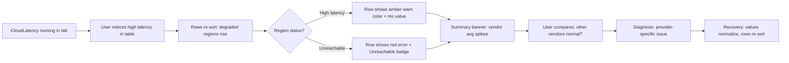
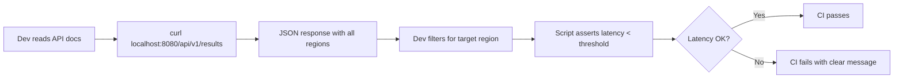
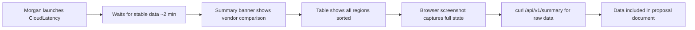

# UX Design Specification CloudLatency

**Author:** Rvunvulea
**Date:** 2026-03-28

---

## Executive Summary

### Project Vision

CloudLatency is a real-time multi-cloud latency monitoring tool for DevOps engineers and SREs. It answers one question: *"Which cloud region is fastest from here, right now?"* across Azure, AWS, and GCP simultaneously. The UX must deliver instant clarity from data-dense, auto-refreshing measurements — with zero configuration friction.

### Target Users

- **Primary: DevOps Engineers & SREs** — Highly technical, accustomed to CLI tools and dashboards. They value data density over visual polish. They scan tables, compare numbers, and make decisions quickly. Desktop-first, often running tools in background browser tabs.
- **Secondary: Platform Architects** — Consume data via REST API and screenshots for reports. Need clear, exportable visuals.
- **Tertiary: API Consumers** — Interact only through REST endpoints, not the UI.

**User tech-savviness:** Expert. These users read terminal output daily. They expect tools to respect their time and intelligence.

### Key Design Challenges

- **Data density at scale** — 50+ cloud regions across 3 providers, all visible in one sorted table. The table is the primary interaction surface — it must be scannable without overwhelming.
- **Real-time without distraction** — Data refreshes every 10 seconds. Updates must be visible but not jarring. Users need to trust freshness without being distracted by constant motion.
- **Error state clarity** — "Unreachable" vs "slow" vs "ok" must be instantly distinguishable in the table. This is critical for the network anomaly journey (Kai's edge case).
- **Charts as secondary, not primary** — Two charts (vendor average, closest region) support the table, not replace it. They must be compact and positioned below.

### Design Opportunities

- **Instant trust** — A connection status indicator and "last updated" timestamp build confidence the data is live and fresh.
- **Scannable color coding** — Subtle provider-based color hints (Azure blue, AWS orange, GCP red/green) let users visually filter without interaction.
- **Zero-chrome DevOps aesthetic** — A minimal, dark-friendly UI that feels like a monitoring tool, not a marketing page. This *is* the competitive advantage — simplicity that respects the user's context.

## Core User Experience

### Defining Experience

The core experience is **passive monitoring with instant comprehension**. Users launch CloudLatency, and the answer to "which region is fastest?" appears in seconds — no interaction required. The sorted latency table is the product's center of gravity. Everything else exists to support it.

**Core action:** Scan a sorted table to identify the fastest cloud region from the user's current network location.

**Core loop:** Launch → table populates → data auto-refreshes → user reads and decides. No clicks, no filters, no configuration steps in the critical path.

### Platform Strategy

| Decision | Choice | Rationale |
| -------- | ------ | --------- |
| Platform | Web SPA (single page) | Universal access, no install beyond Python backend |
| Input mode | Mouse/keyboard, desktop-first | DevOps users work on desktops with wide monitors |
| Offline | Not supported | Tool requires network to measure latency |
| Responsive | Basic mobile readability | Not a priority; desktop is the primary context |
| Browser targets | Chrome, Firefox, Edge, Safari (latest 2) | Standard DevOps browser coverage |

### Effortless Interactions

- **Zero-config launch** — `python -m cloudlatency` opens a browser tab with data streaming. No setup screens, no wizards, no prompts.
- **Auto-sort, auto-refresh** — Table stays sorted by latency and updates every 10 seconds. Users never press a "refresh" button.
- **Self-healing display** — When a region recovers from "unreachable," its row transitions back to normal automatically. No manual intervention.
- **Background-tab friendly** — SSE reconnects silently if the browser tab was backgrounded. Users return to fresh data, not a stale snapshot.

### Critical Success Moments

1. **First table render (T+15-30s)** — The moment the table populates with live data. If this feels fast and the data is immediately scannable, the user trusts the tool. This is the make-or-break moment.
2. **First auto-refresh (T+40s)** — The user sees numbers change without doing anything. This confirms the tool is live and continuous, not a one-shot test.
3. **First anomaly detection** — The first time a region shows "unreachable" or unusually high latency. If the error state is clear and distinct, the user's confidence deepens.

### Experience Principles

1. **Data first, chrome never** — Every pixel serves information. No decorative elements, no marketing copy, no unnecessary whitespace. The table *is* the UI.
2. **Zero interaction required** — The default view answers the default question. Users should get value without clicking anything.
3. **Trust through transparency** — Show connection status, last-updated timestamp, and probe success counts. Never hide failures or staleness.
4. **Respect the expert** — No tooltips explaining what "latency" means. No onboarding modals. These users know what they're looking at — get out of their way.

## Desired Emotional Response

### Primary Emotional Goals

- **Confidence** — "I have the data I need to make this decision." Users feel empowered by clear, continuous, multi-cloud data that eliminates guesswork.
- **Relief** — "This just works." Zero-config launch and instant results create immediate trust that the tool respects their time.
- **Control** — "I can see exactly what's happening." During anomalies, the UI gives users the information to diagnose and report with authority.

### Emotional Journey Mapping

| Stage | Desired Emotion | UX Trigger |
| ----- | --------------- | ---------- |
| First launch | Relief → Confidence | Data appears in seconds, no setup screens |
| First scan | Calm focus | Clean, sorted table — scannable without effort |
| First refresh | Trust | Numbers update silently, confirming liveness |
| Decision moment | Assurance | Clear winner visible; vendor charts reinforce the answer |
| Anomaly detection | Control | Error states are distinct and unambiguous |
| Returning use | Familiarity | Same view, fresh data — no relearning needed |

### Micro-Emotions

- **Confidence over confusion** — Every data point has clear meaning. No ambiguous icons or unlabeled axes.
- **Trust over skepticism** — Connection status and timestamps prove data freshness. Users never wonder "is this stale?"
- **Calm over overwhelm** — 50+ rows sorted by relevance (latency). The most important data is always at the top.
- **Control over anxiety** — Error states are explicit ("Unreachable"), not silent. Users know what they don't know.

### Design Implications

| Emotion | Design Choice |
| ------- | ------------- |
| Confidence | Bold, readable latency numbers; clear provider labels |
| Relief | No config screens; data streams immediately on launch |
| Trust | Visible "Last updated" timestamp; connection status indicator |
| Calm | Minimal UI chrome; no animations except subtle value transitions |
| Control | Distinct error states with status column; structured error messages |

### Emotional Design Principles

1. **Earn trust in 30 seconds** — If the first table render is fast, sorted, and clear, the user trusts the tool for the session.
2. **Never surprise negatively** — Stale data is worse than no data. Always show connection state and freshness.
3. **Quiet competence** — The tool should feel like a well-built instrument: precise, reliable, unremarkable in the best way.
4. **Failure is information** — Errors and unreachable regions are valuable data, not UX failures. Present them with the same clarity as successes.

## UX Pattern Analysis & Inspiration

### Inspiring Products Analysis

**Grafana**
- Dense, multi-panel dashboards with zero decorative elements
- Dark theme as default — reduces eye strain during long monitoring sessions
- Auto-refresh intervals visible in the UI header
- Tables and charts coexist without competing for attention
- *Key lesson:* Data density works when hierarchy is clear. Users don't need whitespace — they need structure.

**htop / btop**
- Real-time, auto-refreshing data with no user interaction needed
- Sorted by default (CPU usage), instantly scannable
- Color coding conveys meaning without labels (green = ok, red = hot)
- Zero onboarding — power users know what they're looking at
- *Key lesson:* The best monitoring UX is passive. Launch, scan, decide.

**Cloudflare Speed Test**
- Web-based, no install, instant results
- Clean progress indication during measurement
- Results appear progressively as tests complete
- Simple, focused — answers one question well
- *Key lesson:* Progressive data display builds anticipation and trust. Show results as they arrive, not all at once.

### Transferable UX Patterns

**Data Display Patterns:**
- **Sorted table as primary view** (htop) — most important data at top, auto-sorted
- **Provider color coding** (Grafana) — subtle color accents for visual grouping without explicit filters
- **Progressive data population** (Cloudflare) — show regions as they respond, don't wait for all probes

**Status Patterns:**
- **Header status bar** (Grafana) — connection state + last refresh time in a fixed header
- **Inline error states** (htop) — errors shown in-row, not in separate modals or toasts

**Layout Patterns:**
- **Table above, charts below** (Grafana panels) — primary data gets prime screen real estate; charts provide summary context below the fold

### Anti-Patterns to Avoid

- **Loading spinners blocking content** — Show partial data as it arrives; never block the full UI waiting for all probes
- **Toast notifications for refresh events** — 10s refresh means a toast every 10s. Absolute disaster. Updates must be silent.
- **Hamburger menus or hidden navigation** — Single-page tool has nothing to navigate. No menus needed.
- **Onboarding wizards or tours** — Instant disqualification for expert users. They'll close the tab.
- **Animated chart transitions** — Gratuitous animation on 10s refresh cycle creates motion sickness, not delight.

### Design Inspiration Strategy

**Adopt:**
- Grafana's data-dense, dark-friendly aesthetic
- htop's "sorted table is the entire UX" philosophy
- Cloudflare's progressive result display

**Adapt:**
- Grafana's panel layout — simplified to one table + two compact charts (no configurable panels needed)
- htop's terminal color coding — web-native provider color accents (Azure blue, AWS orange, GCP green)

**Avoid:**
- Any pattern that interrupts the passive monitoring loop (modals, toasts, wizards)
- Any pattern that assumes the user needs guidance (tooltips, onboarding, help icons)

## Design System Foundation

### Design System Choice

**Approach:** Lightweight custom — Tailwind CSS + vanilla JavaScript + Chart.js

No heavy UI framework (React, Vue) or component library (MUI, Chakra). The UI surface is too small to justify framework overhead: one table, two charts, one status bar.

### Rationale for Selection

| Factor | Decision | Why |
| ------ | -------- | --- |
| Component needs | Minimal (table, charts, status bar) | No forms, modals, or complex interactions |
| Developer profile | Python-first, solo developer | Avoid React/Vue learning curve |
| Bundle size | < 50KB target | Fast first paint; no framework bloat |
| Dark mode | Tailwind's built-in `dark:` utilities | Zero-config dark theme support |
| Charts | Chart.js (~60KB) | Lightweight, well-documented, canvas-based |
| Maintainability | Vanilla JS + HTML templates | No build step required; served directly by Python backend |

### Implementation Approach

- **CSS:** Tailwind CSS via CDN (no build step for MVP). Utility classes for layout, spacing, color, and dark mode.
- **JavaScript:** Vanilla JS for SSE connection, table rendering, and chart updates. No transpilation needed.
- **Charts:** Chart.js for vendor-average bar chart and closest-region chart. Configured once, updated in-place on each SSE event.
- **HTML:** Single `index.html` served by the Python backend. Semantic `<table>` for data, `<canvas>` for charts.

### Customization Strategy

**Design tokens (CSS custom properties):**

- `--color-azure`: `#0078D4` (Azure blue)
- `--color-aws`: `#FF9900` (AWS orange)
- `--color-gcp`: `#4285F4` (GCP blue) / `#34A853` (GCP green)
- `--color-ok`: green accent for healthy latency
- `--color-warn`: amber accent for high latency
- `--color-error`: red accent for unreachable
- `--color-bg`: dark background (Grafana-inspired)
- `--color-text`: light text on dark background

**Typography:** System font stack (`-apple-system, BlinkMacSystemFont, 'Segoe UI', ...`). Monospace for latency numbers (`font-variant-numeric: tabular-nums`).

## Defining Interaction

### The Defining Experience

**"Launch → see the answer."** The user runs one command and within 30 seconds has a sorted, live-updating table answering the question every DevOps engineer asks: *"Which region is fastest from here?"*

No login. No config. No clicking. The defining interaction is *not clicking anything at all* — the tool works by being passively observed.

### User Mental Model

**Current approach:** Users curl individual health endpoints, copy-paste latency numbers into a spreadsheet, and manually sort. They repeat this per provider. It's tedious, error-prone, and produces point-in-time snapshots that go stale immediately.

**Mental model they bring:** They expect a monitoring dashboard (like Grafana or Datadog) — a live, auto-refreshing data view. They'll scan top-to-bottom for the lowest numbers. They understand what "ms" means. They don't need hand-holding.

**Key expectation:** The table should behave like a terminal tool (htop) — always live, always sorted, always showing the full picture.

### Success Criteria for Core Interaction

| Criterion | Indicator |
| --------- | --------- |
| "This just works" | Data appears without any user input after launch |
| "I can trust this" | Numbers update visibly every 10 seconds; timestamp confirms freshness |
| "I found my answer" | Lowest-latency region is obviously at the top of the table |
| "I understand the data" | Provider, region, latency, and status are immediately readable |
| "I can act on this" | Screenshot or API call gives exportable evidence for decisions |

### Pattern Analysis

**Established patterns only** — no novel interactions needed:

- Sorted data table (universal, well-understood)
- Bar chart for averages (standard data viz)
- Live connection indicator (common in real-time tools)
- Auto-refresh without user action (monitoring convention)

**Unique twist:** Combining three providers in one sorted view. No existing tool does this with zero config. The innovation is in *what* is shown, not *how* it's shown.

### Experience Mechanics

**1. Initiation:** `python -m cloudlatency` → Python backend starts, opens browser to `localhost:8080`. No prompts, no options.

**2. Interaction:** User watches. Table populates progressively as probes return. Rows slide into sorted position. After first full cycle (~15s), all regions visible.

**3. Feedback:**

- Row count increases as probes complete (progressive population)
- "Last updated" timestamp ticks every 10s
- Connection status dot: green = live, yellow = reconnecting, red = disconnected
- Unreachable regions show distinct "Unreachable" badge instead of latency number

**4. Completion:** There is no "completion" — the tool runs until closed. The user's task is complete when they've read the answer from the table. They close the tab or Ctrl+C the process.

## Visual Design Foundation

### Color System

**Theme:** Dark-first monitoring aesthetic (Grafana-inspired)

**Background & Surface:**

| Token | Value | Usage |
| ----- | ----- | ----- |
| `--bg-primary` | `#1a1a2e` | Page background |
| `--bg-surface` | `#16213e` | Table background, card surfaces |
| `--bg-header` | `#0f3460` | Header bar, table header row |
| `--bg-row-alt` | `#1a1a3e` | Alternating table rows |

**Provider Colors:**

| Token | Value | Usage |
| ----- | ----- | ----- |
| `--color-azure` | `#0078D4` | Azure rows, chart segments |
| `--color-aws` | `#FF9900` | AWS rows, chart segments |
| `--color-gcp` | `#4285F4` | GCP rows, chart segments |

**Semantic Colors:**

| Token | Value | Usage |
| ----- | ----- | ----- |
| `--color-ok` | `#00d68f` | Healthy latency (< 100ms) |
| `--color-warn` | `#ffaa00` | High latency (100-300ms) |
| `--color-error` | `#ff3d71` | Unreachable / error state |
| `--color-text` | `#e4e6eb` | Primary text |
| `--color-text-muted` | `#8899a6` | Secondary text, labels |
| `--color-status-live` | `#00d68f` | Connection status: live |
| `--color-status-reconnecting` | `#ffaa00` | Connection status: reconnecting |
| `--color-status-disconnected` | `#ff3d71` | Connection status: disconnected |

All color pairings meet WCAG AA contrast ratio (4.5:1 minimum) against dark backgrounds.

### Typography System

**Font stack:** `-apple-system, BlinkMacSystemFont, 'Segoe UI', Roboto, sans-serif`

**Monospace (latency values):** `'JetBrains Mono', 'Fira Code', 'Cascadia Code', monospace`

| Element | Size | Weight | Notes |
| ------- | ---- | ------ | ----- |
| Page title | 20px | 600 | "CloudLatency" in header bar |
| Table header | 13px | 600 | Column labels, uppercase |
| Table cell | 14px | 400 | Region names, provider labels |
| Latency value | 16px | 700 | Monospace, `tabular-nums`, right-aligned |
| Status badge | 12px | 500 | "OK" / "Unreachable" labels |
| Timestamp | 12px | 400 | "Last updated" in header, muted color |
| Chart labels | 12px | 400 | Axis labels, legend text |

### Spacing & Layout Foundation

**Base unit:** 4px. All spacing uses multiples: 4, 8, 12, 16, 24, 32, 48.

**Layout structure (top to bottom):**

1. **Header bar** (48px height) — App title left, connection status + timestamp right. Fixed position.
2. **Latency table** (fills remaining viewport) — Full-width, scrollable if > viewport height. This is 70% of the visual experience.
3. **Charts row** (240px height) — Two charts side by side below the table. Vendor-average bar chart (left), closest-region chart (right).

**Grid:** No formal grid system needed. Single-column layout. Table is full-width. Charts split 50/50 below.

**Density:** Compact. Table rows at 36px height. Minimal padding (8px horizontal, 4px vertical). No whitespace between sections — data fills the screen.

### Accessibility Considerations

- All text/background pairings meet WCAG AA (4.5:1 contrast ratio)
- Semantic `<table>` with `<thead>`, `<tbody>`, `<th scope="col">` for screen readers
- Status conveyed by text label + color (never color-only) — "OK" and "Unreachable" as readable badges
- Keyboard-navigable table rows via `tabindex`
- `prefers-color-scheme` respected (dark is default; light mode via system preference)
- `prefers-reduced-motion` disables value transition animations

## Design Direction Decision

### Directions Explored

Four layout directions were evaluated for CloudLatency's single-page monitoring UI:

| Direction | Concept | Table Viewport | Chart.js | Complexity |
| --------- | ------- | -------------- | -------- | ---------- |
| A: Dashboard Dense | Table + 2 charts below | ~70% | Yes | Medium |
| B: Split View | Table left + charts right | ~65% | Yes | Medium |
| C: Table First | Table + collapsible charts | ~90% | Yes | Medium-High |
| **D: Summary Banner** | **Banner + full table** | **~95%** | **No** | **Low** |

### Chosen Direction: D — Summary Banner + Full Table

First principles analysis revealed that the secondary questions (vendor averages, closest regions) require only 6 numbers — not two full charts. A compact summary banner replaces both charts, giving the table nearly 100% of the viewport.

```
┌─────────────────────────────────────────────────────┐
│ CloudLatency          ● Connected  Updated 2s ago   │  Header (48px)
├─────────────────────────────────────────────────────┤
│ AWS avg: 45ms  │ Azure avg: 62ms │ GCP avg: 58ms   │  Summary banner (36px)
│ Closest: us-e-1│ Closest: west-eu│ Closest: us-c1  │
├─────────────────────────────────────────────────────┤
│ Provider │ Region       │ Latency │ Status          │  Table fills ALL
│ AWS      │ us-east-1    │   32ms  │ OK              │  remaining viewport
│ ...      │ ...          │  ...    │ ...             │
└─────────────────────────────────────────────────────┘
```

### Design Rationale

- **Data density maximized** — Table gets ~95% of viewport; no scrolling for 50+ regions on most monitors
- **Zero dependency added** — No Chart.js needed; pure HTML/CSS summary banner
- **Answers all three questions** — Primary (table sort), secondary (vendor averages in banner), tertiary (closest regions in banner)
- **Implementation simplicity** — Lowest complexity of all directions; faster to MVP
- **Charts deferred, not deleted** — Can be added as Phase 2 enhancement if users request visual summaries

### Implementation Approach

- Header bar: fixed `<header>` with flexbox (title left, status right)
- Summary banner: `<div>` with 3 equal columns, each showing provider avg + closest region
- Latency table: semantic `<table>` with sticky `<thead>`, filling remaining viewport via `calc(100vh - 132px)`
- All provider-colored with CSS custom properties from our design token system

## User Journey Flows

### Journey 1: First Launch — Kai Validates a Region Choice

```mermaid
graph LR
    A["pip install cloudlatency"] --> B["python -m cloudlatency"]
    B --> C["Browser opens localhost:8080"]
    C --> D["Header shows: ● Connecting..."]
    D --> E["SSE connects → ● Connected"]
    E --> F["Rows populate progressively"]
    F --> G["Summary banner fills with averages"]
    G --> H["Table fully sorted, auto-refreshing"]
    H --> I["User reads top row = fastest region"]
```



**Key UX moments:**

- **T+0s:** Browser opens. Header visible immediately. Table empty with "Waiting for data..." placeholder.
- **T+5-15s:** Rows appear one by one as probes return. Each row slides into sorted position. Summary banner updates with each new data point.
- **T+15-30s:** All regions visible. Summary banner shows final averages. User scans top of table for answer.
- **T+40s:** First auto-refresh. Numbers change subtly. Timestamp updates. Trust confirmed.

### Journey 2: Network Anomaly — Kai Diagnoses an Issue



**Key UX moments:**

- Status column instantly distinguishes "slow" (amber, shows ms) from "down" (red, shows "Unreachable")
- Summary banner makes vendor comparison effortless — if one provider's avg spikes while others are stable, the issue is isolated
- Recovery is visible in real time as values drop and rows re-sort

### Journey 3: API Consumer — Dev Builds a CI Gate



**UX note:** This journey has no UI interaction — it's purely API. The UX requirement is clear, consistent JSON and meaningful error messages.

### Journey 4: Morgan — Screenshots for Architecture Proposal



**UX note:** The dark theme and data density make screenshots immediately usable in professional documents. The summary banner provides the headline numbers without needing to explain the full table.

### Journey Patterns

**Common patterns across all journeys:**

- **Progressive disclosure** — Data arrives incrementally, building confidence as the table fills
- **Passive consumption** — No journey requires clicking, filtering, or configuring anything
- **Status at a glance** — Header (connection), banner (vendor summary), table (per-region detail) form a 3-tier information hierarchy
- **Self-documenting** — Screenshots and API responses are immediately useful without explanation

### Flow Optimization Principles

1. **Zero clicks to value** — Every journey reaches its answer without user interaction
2. **Three-tier information hierarchy** — Header (system status) → Banner (vendor summary) → Table (full detail)
3. **Error states are first-class data** — Unreachable regions sort into the table like any other row, with distinct visual treatment
4. **Recovery is automatic** — When a region recovers, its row updates and re-sorts without user action

## Component Strategy

### Design System Components

**From Tailwind CSS (utility classes, not components):**

- Flexbox/grid layouts
- Dark mode utilities (`dark:`)
- Spacing, typography, color utilities
- Responsive breakpoints (basic mobile readability)

No pre-built components used. Tailwind provides styling primitives, not UI components. All components below are custom HTML + CSS + JS.

### Custom Components

**1. Header Bar**

- **Purpose:** Show app identity and system status
- **Anatomy:** App title (left) | Connection status dot + label + "Last updated" timestamp (right)
- **States:** Connected (green dot), Reconnecting (yellow dot, pulsing), Disconnected (red dot)
- **Accessibility:** `role="banner"`, status dot has `aria-label` describing connection state
- **Update behavior:** Timestamp updates every 10s; status dot transitions on SSE state change

**2. Summary Banner**

- **Purpose:** Answer secondary questions (vendor averages, closest regions) in minimal space
- **Anatomy:** 3 equal columns (AWS | Azure | GCP), each showing: provider color accent, average latency, closest region name + latency
- **States:** Loading (shows "—" placeholders), Active (shows data), Partial (shows available providers only if not all 3 configured)
- **Accessibility:** `role="complementary"`, `aria-label="Provider summary"`, each column is a `<section>` with provider name as heading
- **Update behavior:** Recalculated on every SSE event

**3. Latency Table**

- **Purpose:** Primary data view — all regions sorted by latency
- **Anatomy:** Sticky header row (Provider | Region | Latency | Status), data rows sorted ascending by latency
- **Columns:**
  - Provider: text + provider color left-border accent
  - Region: text (e.g., `us-east-1`)
  - Latency: monospace number, right-aligned, `tabular-nums` (`32 ms`)
  - Status: badge — "OK" (green), "Slow" (amber), "Unreachable" (red)
- **States:** Empty ("Waiting for data..."), Populating (rows appearing progressively), Active (all rows, auto-refreshing), Error row (unreachable regions)
- **Accessibility:** Semantic `<table>`, `<thead>`, `<th scope="col">`, `<tbody>`, sortable via `aria-sort`
- **Update behavior:** Full re-render on each SSE event; rows re-sort in place

**4. Connection Status Indicator**

- **Purpose:** Build trust that data is live
- **Anatomy:** Colored dot (8px circle) + text label ("Connected" / "Reconnecting..." / "Disconnected")
- **States:** 3 states mapped to semantic colors
- **Accessibility:** `role="status"`, `aria-live="polite"` for screen reader announcements on state change

**5. Status Badge**

- **Purpose:** Inline status for each table row
- **Anatomy:** Pill-shaped badge with background color + text
- **Variants:** OK (green bg, "OK"), Slow (amber bg, "Slow"), Unreachable (red bg, "Unreachable")
- **Accessibility:** Text label always present (never color-only)

### Component Hierarchy

```text
<body>
  └─ Header Bar
       ├─ App Title
       └─ Connection Status Indicator + Timestamp
  └─ Summary Banner
       ├─ AWS Column (avg + closest)
       ├─ Azure Column (avg + closest)
       └─ GCP Column (avg + closest)
  └─ Latency Table
       ├─ Sticky Header Row
       └─ Data Rows (×50+)
            └─ Status Badge (per row)
```

### Component Implementation Roadmap

**MVP (all components — the UI is this small):**

All 5 components are needed for MVP. There are no Phase 2 or Phase 3 components — the entire UI ships at once. Future enhancements (charts, filters, export) would add new components, not modify these.

## UX Consistency Patterns

### Feedback Patterns

**Real-time data updates:**

- Values change in-place silently — no flash, no highlight, no animation (respects `prefers-reduced-motion` by default)
- If `prefers-reduced-motion` is not set, a subtle 200ms CSS transition on value change provides visual continuity
- New rows during progressive population fade in over 150ms

**Connection state feedback:**

| State | Visual | Text | Behavior |
| ----- | ------ | ---- | -------- |
| Connecting | Yellow pulsing dot | "Connecting..." | Shown on initial page load |
| Connected | Green steady dot | "Connected" | Normal operating state |
| Reconnecting | Yellow pulsing dot | "Reconnecting..." | SSE dropped, auto-retry active |
| Disconnected | Red steady dot | "Disconnected" | After max retries; data frozen |

**Timestamp freshness:**

- "Updated Xs ago" — relative time, updates every second
- At 0-10s: green text (fresh)
- At 11-30s: amber text (stale warning)
- At 30s+: red text (data frozen)

### Empty & Loading States

**Initial load (no data yet):**

- Header: visible immediately with "Connecting..." status
- Summary banner: shows "—" placeholders for all 3 providers
- Table: single centered row spanning all columns: "Waiting for data..." in muted text

**Progressive population:**

- Each row appears as its probe returns
- Summary banner recalculates with each new data point
- No skeleton screens or shimmer effects — real data replaces the empty state incrementally

**SSE disconnection:**

- Data freezes in place (last known values)
- Timestamp turns red and stops updating
- Connection status shows "Disconnected"
- Data is NOT cleared — stale data is better than no data

### Error Display Patterns

**Per-region errors (inline):**

- Unreachable regions stay in the table with "Unreachable" badge (red)
- Latency column shows "—" instead of a number
- Row sorted to bottom of table (highest "latency")

**System-level errors:**

- Connection failures shown only via the header status indicator
- No toast notifications, no modals, no alert banners
- Errors self-resolve when connectivity returns

**API errors (REST):**

- Standard HTTP status codes (404, 500, 503)
- JSON error body: `{ "error": "message", "code": "ERROR_CODE" }`
- No HTML error pages for API routes

### Navigation Patterns

None. Single-page tool with no navigation. No sidebar, no tabs, no routing. The URL is always `/`. The only "navigation" is scrolling the table.

### Data Formatting Patterns

| Data Type | Format | Example |
| --------- | ------ | ------- |
| Latency | Integer + unit, right-aligned, monospace | `32 ms` |
| Provider | Title case, provider-colored | `AWS`, `Azure`, `GCP` |
| Region | Lowercase, provider's naming convention | `us-east-1`, `westeurope`, `us-central1` |
| Status | Capitalized badge | `OK`, `Slow`, `Unreachable` |
| Timestamp | Relative, auto-updating | `Updated 3s ago` |
| Average | Integer + unit | `45 ms` |

### Interaction Patterns

**Keyboard:** Tab moves focus through table rows. No keyboard shortcuts needed for MVP.

**Mouse:** No click actions. Hover on table rows shows subtle `bg-row-alt` highlight for scanability. No cursor change (no pointer — nothing is clickable).

**Selection:** None. No row selection, no multi-select, no context menus. The tool is read-only.

## Responsive Design & Accessibility

### Responsive Strategy

**Desktop-first.** CloudLatency's primary use case is a desktop browser tab alongside terminal windows and other DevOps tools. Mobile is a secondary, read-only scenario.

**Desktop (1024px+):** Full experience — header, summary banner, full table with all 4 columns visible. This is the design as specified in all previous sections.

**Tablet (768px-1023px):** Same layout, slightly reduced padding. Table remains full-width with all columns. Summary banner columns may wrap to 2+1 layout if needed.

**Mobile (320px-767px):** Simplified view:

- Header: title and status stack vertically
- Summary banner: single column, 3 stacked provider cards
- Table: horizontal scroll enabled; Provider + Region + Latency visible, Status column hidden (latency color coding provides sufficient status signal)
- Touch targets: rows at 44px minimum height for tap accessibility

### Breakpoint Strategy

| Breakpoint | Width | Layout Change |
| ---------- | ----- | ------------- |
| `sm` | < 640px | Stacked header, stacked banner, horizontal-scroll table |
| `md` | 640px-1023px | Side-by-side header, 2+1 banner, full table |
| `lg` | ≥ 1024px | Full design as specified (primary target) |

**Approach:** Desktop-first with `max-width` media queries for smaller screens. Tailwind's responsive prefixes (`sm:`, `md:`, `lg:`) handle all breakpoints.

### Accessibility Strategy

**Target: WCAG 2.1 AA compliance.** This is appropriate for a developer tool — covers all essential accessibility without the overhead of AAA.

**Semantic HTML checklist:**

- `<header role="banner">` for header bar
- `<main>` wrapping summary banner + table
- `<table>` with `<thead>`, `<tbody>`, `<th scope="col">`
- `<section>` for each summary banner column
- Status indicator: `role="status"`, `aria-live="polite"`

**Color accessibility:**

- All text meets 4.5:1 contrast against backgrounds (verified in Visual Foundation)
- Status never conveyed by color alone — always includes text label
- Provider identity conveyed by text label + color (not color-only)

**Motion accessibility:**

- `prefers-reduced-motion: reduce` disables all CSS transitions
- No auto-playing animations; value changes are instant when motion is reduced

**Screen reader support:**

- Table sortable column announced via `aria-sort="ascending"` on Latency header
- Connection status changes announced via `aria-live="polite"`
- Summary banner values readable as structured content (not decorative)

### Testing Strategy

**Responsive testing:**

- Chrome DevTools device emulation for breakpoint verification
- Real browser testing: Chrome, Firefox, Edge, Safari (latest 2 versions)
- No dedicated mobile device testing required for MVP (basic readability only)

**Accessibility testing:**

- Lighthouse accessibility audit (target: 90+ score)
- `axe-core` automated testing integrated into development
- Manual keyboard-only navigation test (Tab through all focusable elements)
- Screen reader spot-check with NVDA (Windows) or VoiceOver (macOS)

### Implementation Guidelines

**For developers:**

- Use semantic HTML elements over `<div>` soup
- Always include `alt`, `aria-label`, or `aria-labelledby` where needed
- Test with keyboard after every UI change
- Use `rem` for font sizes, `px` for borders/shadows only
- Include `<meta name="viewport" content="width=device-width, initial-scale=1">` in HTML head
- Add `lang="en"` to `<html>` element
- Ensure focus ring is visible on all interactive elements (Tailwind's `focus:ring-2`)
