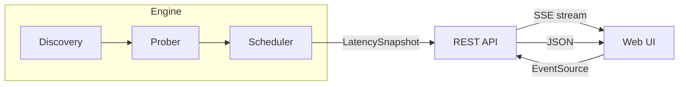

# Architecture

<!-- docguard:version 1.0.0 -->
<!-- docguard:status approved -->
<!-- docguard:last-reviewed 2026-03-26 -->
<!-- docguard:owner @cloudlatency -->

> **Canonical document** — Design intent. This file describes WHAT the system is designed to be.  
> ⚠️ Changes to this file require team review. Update `DRIFT-LOG.md` if code deviates.

| Metadata | Value |
|----------|-------|
| **Status** |  |
| **Version** | `1.0.0` |
| **Last Updated** | 2026-03-26 |
| **Owner** | @cloudlatency |

---

## System Overview

CloudLatency is a Python web application that measures HTTPS latency to all Azure, AWS, and GCP regions worldwide. It displays a sorted latency table and vendor summary charts, auto-refreshing every 10 seconds via Server-Sent Events. It is designed for developers and cloud architects who need real-time visibility into cross-cloud network performance.

## Component Map

| Component | Responsibility | Location | Tests |
|-----------|---------------|----------|-------|
| Latency Engine | Region discovery, HTTPS HEAD probing, measurement scheduling | `cloudlatency/engine/` | `tests/unit/test_discovery.py`, `test_prober.py`, `test_scheduler.py` |
| REST API | JSON endpoints, SSE streaming, static file serving | `cloudlatency/api/` | `tests/unit/test_routes.py`, `test_sse.py` |
| Web UI | Dashboard with sorted table and Chart.js bar charts | `cloudlatency/ui/static/` | Browser-based testing |
| Configuration | Environment-based settings with defaults | `cloudlatency/config.py` | `tests/unit/test_config.py` |

## Layer Boundaries

| Layer | Can Import From | Cannot Import From |
|-------|----------------|-------------------|
| Web UI (JavaScript) | REST API (via HTTP/SSE) | Engine, Config |
| REST API | Engine models, Config | UI static files (serves only) |
| Engine | Config, Models | API, UI |
| Config | Standard library only | Engine, API, UI |

## Tech Stack

| Category | Technology | Version | License |
|----------|-----------|---------|---------|
| Language | Python | 3.11+ | PSF |
| Framework | FastAPI | latest | MIT |
| ASGI Server | uvicorn | latest | BSD |
| HTTP Client | aiohttp | latest | Apache 2.0 |
| SSE | sse-starlette | latest | BSD |
| Validation | pydantic | v2+ | MIT |
| Charts | Chart.js | latest | MIT |
| Testing | pytest, pytest-asyncio, pytest-cov | latest | MIT |
| Linting | ruff, black | latest | MIT |

## External Dependencies

| Service | Purpose | SLA | Fallback |
|---------|---------|-----|----------|
| AWS IP Ranges API | Region discovery | Best-effort (public JSON) | Cached region list from last successful fetch |
| Azure Management API | Region discovery | Best-effort (public endpoint) | Cached region list |
| GCP IP Ranges API | Region discovery | Best-effort (public JSON) | Cached region list |
| Cloud region HTTPS endpoints | Latency probing | N/A | Mark as unreachable after 5s timeout |

## Configuration Files

| File/Directory | Purpose |
|----------------|---------|
| `.specify/` | Spec Kit configuration, templates, extensions, and constitution |
| `.windsurf/` | Windsurf IDE workflow definitions (slash commands) |
| `.docguard.json` | DocGuard CDD validator configuration (profile, doc selection) |
| `.agent/` | DocGuard AI skills installed for agent-assisted documentation |

## Diagrams

---

## Revision History

| Version | Date | Author | Changes |
|---------|------|--------|---------|
| 1.0.0 | 2026-03-26 | CloudLatency | Initial architecture based on spec and plan |
