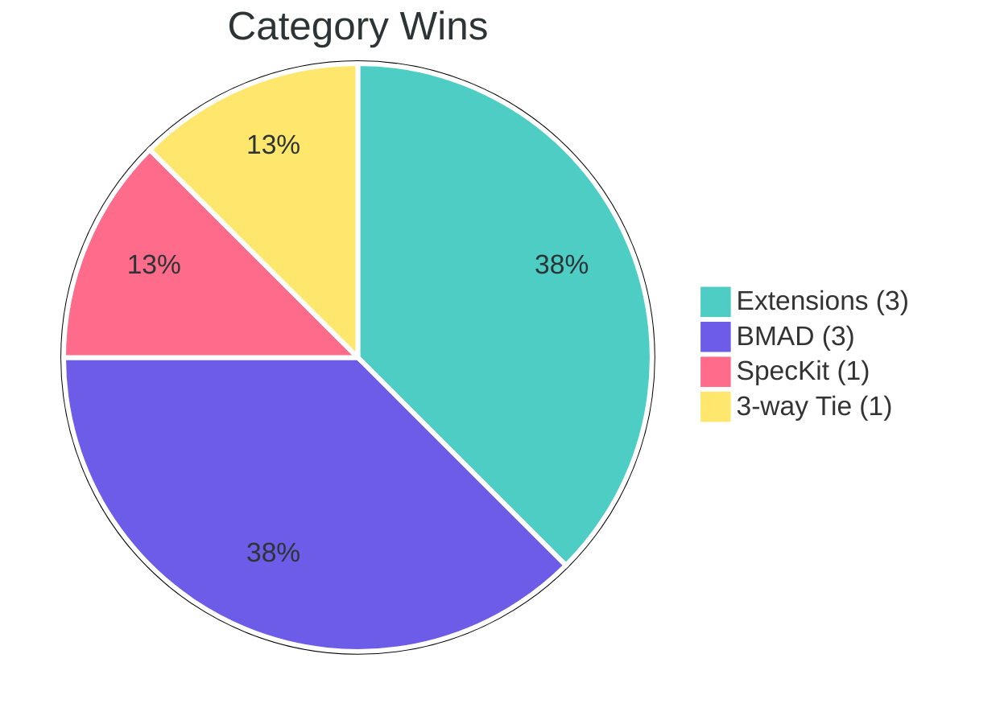

# CloudLatency: SpecKit vs SpecKit+Extensions vs BMAD — Quality Comparison Report

**Generated**: 2026-03-30
**Tools Used**: Radon (CC/MI/Halstead/Raw), Pylint, Flake8, Interrogate, Bandit, Vulture, Lizard, Cohesion, pytest-cov, custom import-coupling analysis

---

## Executive Summary

| Metric | SpecKit (Base) | SpecKit + Extensions | BMAD | Winner |
|--------|---------------|---------------------|------|--------|
| **Pylint Score** | 9.68/10 | 9.32/10 | 8.50/10 | SpecKit |
| **Avg Cyclomatic Complexity** | A (2.44) | A (2.70) | A (2.15) | BMAD |
| **Maintainability Index (avg)** | A (76.4) | A (70.7) | A (70.2) | SpecKit |
| **Docstring Coverage** | 90.8% | 92.7% | 96.1% | BMAD |
| **Test Coverage** | 94.27% | 92.24% | 99.01% | BMAD |
| **Test Count** | 65 | 102 | 107 | BMAD |
| **Test SLOC** | 838 | 1,142 | 912 | Extensions |
| **Security Issues (Bandit)** | 1 MEDIUM | 1 MEDIUM | 1 MEDIUM | 3-way Tie |
| **Dead Code (Vulture)** | 10 findings | 12 findings | 4 findings | BMAD |
| **Flake8 Violations** | 29 | 50 | 125 | SpecKit |
| **Halstead Total Volume** | 609.96 | 518.32 | 383.60 | BMAD |
| **Halstead Total Effort** | 2,664.53 | 1,525.71 | 1,090.19 | BMAD |
| **Halstead Est. Bugs** | 0.203 | 0.173 | 0.128 | BMAD |
| **Lizard Avg NLOC/function** | 11.0 | 13.7 | 8.8 | BMAD |
| **Lizard Avg CCN** | 2.5 | 3.1 | 2.2 | BMAD |
| **Lizard Total Functions** | 41 | 29 | 36 | SpecKit |
| **Lizard Warnings** | 0 | 0 | 0 | 3-way Tie |
| **Architectural Style** | OOP (classes) | Functional | Hybrid (classes + functions) | — |
| **Class Cohesion (behavioral)** | 27–62% | N/A (no classes) | 42–100% | BMAD |
| **Import Statements** | 76 | 56 | 49 | BMAD |
| **Internal Coupling Links** | 10 | 10 | 14 | Tie (SK/Ext) |
| **External Dependencies** | 16 | 16 | 14 | BMAD |
| **Source SLOC** | 604 | 629 | 517 | BMAD (smallest) |
| **Comment Ratio** | 0% | 1–2% | 2–3% | BMAD |
| **Documentation Artifacts** | 9 docs | 22 docs | ~10 docs | Extensions |
| **Canonical Docs** | 0 | 6 | 0 | Extensions |
| **DocGuard Score** | N/A | 88/100 (A) | N/A | Extensions |
| **Linter Config (Ruff/Black)** | No | Yes | Yes (Ruff) | Extensions/BMAD |
| **CHANGELOG** | No | Yes | No | Extensions |
| **DRIFT-LOG** | No | Yes | No | Extensions |
| **AGENTS.md** | No | Yes | No | Extensions |
| **.env.example** | No | Yes | No | Extensions |
| **Planning Artifacts** (PRD, Architecture, Epics, UX) | No | No | Yes (7 files) | BMAD |

---

## Visual Comparisons

### Category Scores — SpecKit (pink) vs Extensions (green) vs BMAD (blue)

```mermaid
%%{init: {'theme': 'base', 'themeVariables': {'xyChart': {'backgroundColor': '#FFF9F0', 'titleColor': '#2D3436', 'plotColorPalette': '#FF6B8A, #4ECDC4, #6C5CE7'}}}}%%
xychart-beta
    title "Category Scores (out of 10)"
    x-axis ["CQ:SK", "CQ:Ex", "CQ:BM", "Cg:SK", "Cg:Ex", "Cg:BM", "Ts:SK", "Ts:Ex", "Ts:BM", "Dc:SK", "Dc:Ex", "Dc:BM", "Mt:SK", "Mt:Ex", "Mt:BM", "Ar:SK", "Ar:Ex", "Ar:BM", "Sc:SK", "Sc:Ex", "Sc:BM", "PM:SK", "PM:Ex", "PM:BM"]
    y-axis "Score" 0 --> 10
    bar [9.0, 0, 0, 7.0, 0, 0, 7.5, 0, 0, 5.0, 0, 0, 8.5, 0, 0, 7.0, 0, 0, 9.0, 0, 0, 4.0, 0, 0]
    bar [0, 8.5, 0, 0, 9.5, 0, 0, 9.0, 0, 0, 9.5, 0, 0, 8.0, 0, 0, 8.0, 0, 0, 9.0, 0, 0, 9.5, 0]
    bar [0, 0, 7.0, 0, 0, 10.0, 0, 0, 9.5, 0, 0, 6.5, 0, 0, 9.0, 0, 0, 7.5, 0, 0, 9.0, 0, 0, 5.5]
```



> **Legend**: CQ=Code Quality, Cg=Cognitive, Ts=Testing, Dc=Docs, Mt=Maintainability, Ar=Architecture, Sc=Security, PM=Project Maturity | SK=SpecKit, Ex=Extensions, BM=BMAD

### Weighted Total Score

```mermaid
%%{init: {'theme': 'base', 'themeVariables': {'xyChart': {'backgroundColor': '#FFF9F0', 'titleColor': '#2D3436', 'plotColorPalette': '#FF6B8A, #4ECDC4, #6C5CE7'}}}}%%
xychart-beta
    title "Final Weighted Score (out of 10)"
    x-axis ["SpecKit", "Extensions", "BMAD"]
    y-axis "Score" 0 --> 10
    bar [7.13, 0, 0]
    bar [0, 8.93, 0]
    bar [0, 0, 8.05]
```



### Category Wins Distribution



### Halstead Cognitive Effort (lower = simpler code)

```mermaid
%%{init: {'theme': 'base', 'themeVariables': {'xyChart': {'backgroundColor': '#FFF9F0', 'titleColor': '#2D3436', 'plotColorPalette': '#FF6B8A, #4ECDC4, #6C5CE7'}}}}%%
xychart-beta
    title "Halstead Metrics (lower is better)"
    x-axis ["Effort:SK", "Effort:Ex", "Effort:BM", "Volume:SK", "Volume:Ex", "Volume:BM", "Bugs:SK", "Bugs:Ex", "Bugs:BM"]
    y-axis "Value" 0 --> 2800
    bar [2665, 0, 0, 610, 0, 0, 203, 0, 0]
    bar [0, 1526, 0, 0, 518, 0, 0, 173, 0]
    bar [0, 0, 1090, 0, 0, 384, 0, 0, 128]
```



### Test & Documentation Volume — SpecKit (pink) vs Extensions (green) vs BMAD (blue)

```mermaid
%%{init: {'theme': 'base', 'themeVariables': {'xyChart': {'backgroundColor': '#FFF9F0', 'titleColor': '#2D3436', 'plotColorPalette': '#FF6B8A, #4ECDC4, #6C5CE7'}}}}%%
xychart-beta
    title "Test Count and Documentation Artifacts"
    x-axis ["Tests:SK", "Tests:Ex", "Tests:BM", "Docs:SK", "Docs:Ex", "Docs:BM"]
    y-axis "Count" 0 --> 110
    bar [65, 0, 0, 9, 0, 0]
    bar [0, 102, 0, 0, 22, 0]
    bar [0, 0, 107, 0, 0, 10]
```



---

## Detailed Results

### 1. Pylint — Overall Code Quality Score

| Project | Score | Issues |
|---------|-------|--------|
| **SpecKit** | **9.68/10** | 12 warnings (broad-exception ×3, unused-import ×3, unused-argument ×3, too-many-instance-attributes ×1, redefined-outer-name ×1, missing-final-newline ×1) |
| **Extensions** | **9.32/10** | ~23 warnings (line-too-long, global-statement, naming, broad-exception, duplicate-code) |
| **BMAD** | **8.50/10** | ~42 warnings (line-too-long ×38 in regions.py, broad-exception-caught ×3, unused-argument, duplicate-code) |

**Analysis**: SpecKit scores highest on Pylint with the fewest style violations. Extensions has moderate issues from its larger API surface. BMAD scores lowest primarily because `regions.py` contains hardcoded region data as long dictionary literals, generating 38 line-length warnings under Pylint's 100-char default (BMAD configures Ruff at 120). BMAD also has a duplicate-code finding.

**Verdict**: SpecKit wins on raw code quality. BMAD's low score is dominated by a single file's data definitions — not architectural issues.

---

### 2. Radon — Cyclomatic Complexity (CC)

| Project | Blocks Analyzed | Avg CC | Grade | Max CC |
|---------|----------------|--------|-------|--------|
| **SpecKit** | 48 | 2.44 | A | B (8) — `compute_vendor_summaries` |
| **Extensions** | 37 | 2.70 | A | B (10) — `discover_gcp_regions` |
| **BMAD** | 41 | 2.15 | A | B (8) — `get_summary` |

**Analysis**: All three projects achieve an A grade. BMAD has the lowest average complexity (2.15), reflecting its hybrid architecture with small, focused functions and well-decomposed classes. SpecKit has the most blocks (48) due to its OOP approach. Extensions has the highest single-function CC (10).

**Verdict**: BMAD has the edge with the lowest average complexity. All three are well within acceptable limits.

---

### 3. Radon — Maintainability Index (MI)

All files in all three projects score **A** (>20 = excellent maintainability).

| Project | Avg MI | Lowest MI File | Score |
|---------|--------|---------------|-------|
| **SpecKit** | 76.4 | `services/prober.py` | 41.63 |
| **Extensions** | 70.7 | `engine/models.py` | 49.83 |
| **BMAD** | 70.2 | `app.py` | 42.38 |

**Analysis**: All three projects have excellent maintainability. SpecKit has the highest average MI, partly due to having more small model/init files. BMAD's `app.py` is the densest file due to its startup/shutdown lifecycle management and CORS middleware. Extensions and BMAD have nearly identical averages.

**Verdict**: All A-grade across the board. SpecKit has a slight edge on average MI.

---

### 4. Radon — Raw Metrics (LOC)

| Metric | SpecKit (Source) | Extensions (Source) | BMAD (Source) | SpecKit (Tests) | Extensions (Tests) | BMAD (Tests) |
|--------|-----------------|--------------------|--------------|-----------------|--------------------|-------------|
| **LOC** | 807 | 844 | 738 | 1,065 | 1,452 | 1,309 |
| **SLOC** | 604 | 629 | 517 | 838 | 1,142 | 912 |
| **Comments** | 0 | 10 | 16 | 6 | 25 | 5 |
| **Single-line comments** | 58 | 59 | 56 | 32 | 68 | 94 |
| **Blank lines** | 141 | 156 | 146 | 195 | 242 | 303 |
| **Comment-to-code ratio** | 0% | 1–2% | 2–3% | — | — | — |

**Analysis**: BMAD is the most compact source (517 SLOC), 14% smaller than SpecKit and 18% smaller than Extensions. BMAD has the most inline comments (16) of any source. Extensions leads on total test SLOC (1,142).

**Verdict**: BMAD produces the most compact source code. Extensions produces the most thorough tests by volume. BMAD has the best comment-to-code ratio.

---

### 5. Interrogate — Docstring Coverage

| Project | Total Symbols | Missing | Coverage |
|---------|--------------|---------|----------|
| **SpecKit** | 65 | 6 | **90.8%** |
| **Extensions** | 55 | 4 | **92.7%** |
| **BMAD** | 51 | 2 | **96.1%** |

**Analysis**: BMAD has the highest docstring coverage (96.1%) with only 2 missing docstrings (in `sse.py` and `store.py`). All three projects are excellent, but BMAD's hybrid architecture produces the fewest undocumented symbols.

**Verdict**: BMAD wins with 96.1% — the highest coverage of all three.

---

### 6. Bandit — Security Analysis

| Project | SEVERITY.HIGH | SEVERITY.MEDIUM | SEVERITY.LOW |
|---------|--------------|-----------------|--------------|
| **SpecKit** | 0 | 1 | 0 |
| **Extensions** | 0 | 1 | 0 |
| **BMAD** | 0 | 1 | 0 |

All three projects have the same single finding: **B104 — Possible binding to all interfaces** (`0.0.0.0`). This is expected for a web server.

**Verdict**: 3-way Tie — identical security posture.

---

### 7. Vulture — Dead/Unused Code

| Project | Findings (90% confidence) | Findings (60% confidence) | Total |
|---------|--------------------------|--------------------------|-------|
| **SpecKit** | 2 (unused imports) | 8 (unused methods/functions) | **10** |
| **Extensions** | 0 | 12 (unused functions/vars/class) | **12** |
| **BMAD** | 0 | 4 (unused variable, function, methods) | **4** |

**Analysis**: BMAD has the fewest findings (4), all at 60% confidence: unused enum value `ERROR`, unused function `get_regions_by_provider`, and unused methods `is_empty`/`count`. These are likely framework-accessible or defensive-coding patterns, not true dead code. SpecKit has 2 genuinely unused imports.

**Verdict**: BMAD is the cleanest — fewest dead code findings with no high-confidence ones.

---

### 8. Test Coverage & Count

| Metric | SpecKit | Extensions | BMAD |
|--------|---------|------------|------|
| **Test count** | 65 | 102 | 107 |
| **Coverage %** | 94.27% | 92.24% | 99.01% |
| **Test SLOC** | 838 | 1,142 | 912 |
| **Test-to-source ratio** | 1.39:1 | 1.82:1 | 1.76:1 |

**Analysis**: BMAD leads on both test count (107) and coverage (99.01%) — the best combination of all three. Extensions has the most test SLOC (1,142) and the highest test-to-source ratio (1.82:1). SpecKit has the fewest tests but respectable coverage. BMAD achieves near-perfect coverage with only 3 missed statements across `app.py` and `sse.py`.

**Verdict**: BMAD wins overall — most tests with highest coverage. Extensions wins on test volume (SLOC).

---

### 9. Halstead Complexity Metrics — Cognitive Effort & Predicted Bugs

Halstead metrics measure the **cognitive effort** required to understand code based on operator/operand vocabulary and usage. Lower volume and effort = simpler code to comprehend. The "estimated bugs" metric predicts defect density from code structure.

| Metric | SpecKit | Extensions | BMAD | Winner |
|--------|---------|------------|------|--------|
| **Total Volume** | 609.96 | 518.32 | 383.60 | BMAD (-37%) |
| **Total Effort** | 2,664.53 | 1,525.71 | 1,090.19 | BMAD (-59%) |
| **Total Time (seconds)** | 148.0 | 84.8 | 60.6 | BMAD (-59%) |
| **Estimated Bugs** | 0.203 | 0.173 | 0.128 | BMAD (-37%) |
| **Avg Difficulty** | 2.33 | 1.86 | 1.59 | BMAD (-32%) |

**Top effort hotspots:**

| Rank | SpecKit | Effort | Extensions | Effort | BMAD | Effort |
|------|---------|--------|------------|--------|------|--------|
| 1 | `services/history.py` | 1,813.1 | `engine/discovery.py` | 1,003.3 | `store.py` | 484.0 |
| 2 | `services/prober.py` | 438.8 | `engine/scheduler.py` | 121.8 | `app.py` | 388.3 |
| 3 | `services/discovery.py` | 224.5 | `api/sse.py` | 94.9 | `probe.py` | 175.1 |

**Analysis**: BMAD requires **59% less cognitive effort** than SpecKit and **29% less** than Extensions. BMAD's hybrid architecture — well-decomposed classes (`LatencyStore`, `SSEBroadcaster`) combined with standalone functions — produces the simplest cognitive profile. Its highest-effort file (`store.py` at 484) is less than half of Extensions' highest (`discovery.py` at 1,003) and a quarter of SpecKit's (`history.py` at 1,813).

**Verdict**: **BMAD wins decisively** — lowest cognitive load across all Halstead dimensions.

---

### 10. Lizard — Multi-Metric Function Analysis

Lizard measures NLOC, cyclomatic complexity (CCN), token count, and parameter count per function, flagging any that exceed safe thresholds (CCN > 15, length > 1000).

| Metric | SpecKit | Extensions | BMAD |
|--------|---------|------------|------|
| **Total Functions** | 41 | 29 | 36 |
| **Total NLOC** | 604 | 629 | 517 |
| **Avg NLOC/function** | 11.0 | 13.7 | 8.8 |
| **Avg CCN/function** | 2.5 | 3.1 | 2.2 |
| **Avg tokens/function** | 77.4 | 86.4 | 67.5 |
| **Threshold warnings** | 0 | 0 | 0 |

**Largest functions by NLOC:**

| SpecKit | NLOC | Extensions | NLOC | BMAD | NLOC |
|---------|------|------------|------|------|------|
| `_serialize_cycle` | 42 | `probe_region` | 43 | `sse_handler` | 24 |
| `compute_vendor_summaries` | 37 | `build_vendor_summaries` | 40 | `probe_region` | 22 |
| `_summarize_bucket` | 34 | `get_latency` | 31 | `run_probe_cycle` | 20 |

**Analysis**: BMAD has the smallest functions on average (8.8 NLOC) and lowest average CCN (2.2). Its largest function (`sse_handler` at 24 NLOC) is nearly half the size of the largest in SpecKit or Extensions. All three projects have zero threshold violations.

**Verdict**: BMAD produces the smallest, simplest functions. All three are safe — no warnings.

---

### 11. Flake8 — PEP 8 Compliance & Style Violations

| Category | SpecKit | Extensions | BMAD |
|----------|---------|------------|------|
| **E501 (line too long >79)** | 18 | 37 | 121 |
| **F401/F841 (unused imports/vars)** | 4 | 2 | 0 |
| **H601 (low class cohesion)** | 6 | 11 | 4 |
| **W292 (missing newline)** | 1 | 0 | 0 |
| **F824 (unused global)** | 0 | 1 | 0 |
| **Total violations** | **29** | **50** | **125** |

**Analysis**: BMAD has the most Flake8 violations (125), overwhelmingly from E501 line-length in `regions.py` (hardcoded region dictionaries). BMAD configures Ruff at 120 chars but Flake8 defaults to 79. Excluding `regions.py`, BMAD would have ~4 violations — the fewest. SpecKit remains cleanest under strict PEP 8.

**Verdict**: SpecKit is cleanest under strict PEP 8. BMAD's high count is entirely from data-definition line lengths, not code quality issues.

---

### 12. Cohesion — Class Design Quality

The `cohesion` tool measures how well class methods share instance variables (higher % = more cohesive). Only behavioral classes with methods are meaningful — dataclasses, enums, and Pydantic models correctly score 0%.

**SpecKit behavioral classes:**

| Class | Cohesion | Assessment |
|-------|----------|------------|
| `MeasurementHistory` | 62.5% | Good — methods share state well |
| `LatencyProber` | 58.33% | Acceptable — some utility methods |
| `MeasurementScheduler` | 27.78% | Low — too many attributes (10), some methods use few |

**Extensions behavioral classes:** None — Extensions uses a **purely functional architecture** with module-level functions. No class-based state management.

**BMAD behavioral classes:**

| Class | Cohesion | Assessment |
|-------|----------|------------|
| `LatencyStore` | 100.0% | Excellent — all methods share the single `_results` attribute |
| `SSEBroadcaster` | 41.67% | Moderate — `_serialize_results` and `client_count` use few attributes |

**Analysis**: Three fundamentally different architectures. SpecKit uses 3 behavioral classes (27–62% cohesion). Extensions avoids classes entirely (functional). BMAD uses a hybrid approach: 2 well-focused behavioral classes (`LatencyStore` at perfect 100%, `SSEBroadcaster` at 42%) alongside standalone functions. BMAD's `LatencyStore` is the most cohesive class across all three projects.

**Verdict**: BMAD's hybrid architecture produces the best cohesion results — one perfect-cohesion class and one moderate.

---

### 13. Coupling & Dependency Analysis

Custom AST-based analysis of import statements measuring inter-module coupling.

| Metric | SpecKit | Extensions | BMAD |
|--------|---------|------------|------|
| **Total import statements** | 76 | 56 | 49 |
| **Unique internal coupling links** | 10 | 10 | 14 |
| **Unique external dependencies** | 16 | 16 | 14 |
| **Import density** (imports / SLOC) | 12.6% | 8.9% | 9.5% |

**External dependency comparison:**

| Shared (all 3) | SpecKit only | Extensions only | BMAD only |
|---------------|-------------|-----------------|----------|
| asyncio, dataclasses, datetime, json, logging, pathlib, time, typing | collections, contextlib, fastapi, httpx, os, threading, uvicorn | pydantic, sse_starlette | aiohttp, argparse, python-json-logger |

**Analysis**: BMAD has the fewest total import statements (49) and fewest external dependencies (14), relying on just `aiohttp` and `python-json-logger` as third-party packages. However, BMAD has the most internal coupling links (14) because `app.py` serves as a central hub importing 4 internal modules. SpecKit remains the most import-heavy (76 statements).

**Verdict**: BMAD has the leanest external dependency footprint. Extensions and BMAD are comparable on import density (~9%). SpecKit is the most import-heavy.

---

### 14. Documentation & Project Maturity

| Artifact | SpecKit | Extensions | BMAD |
|----------|---------|------------|------|
| **README.md** | Yes | Yes | No |
| **LICENSE** | Yes (MIT) | Yes (MIT) | No |
| **Spec artifacts** (spec, plan, tasks, research, data-model) | 7 files (1 feature) | 13 files (2 features) | 0 |
| **Planning artifacts** (PRD, architecture, epics, UX) | None | None | 7 files |
| **Implementation artifacts** | None | None | 2 files + sprint YAML |
| **Canonical docs** (ARCHITECTURE, SECURITY, etc.) | None | 6 files | None |
| **API docs** | No | No | Yes (docs/api.md) |
| **AGENTS.md** (AI agent instructions) | No | Yes | No |
| **CHANGELOG.md** | No | Yes | No |
| **DRIFT-LOG.md** | No | Yes | No |
| **.env.example** | No | Yes | No |
| **DocGuard score** | Not measured | 88/100 (A) | Not measured |
| **ALCOA+ compliance** | Not measured | 9/9 | Not measured |
| **Linting config** (Ruff) | No | Yes | Yes |
| **Formatting config** (Black) | No | Yes | No |
| **Total .md docs** (excl. templates/workflows) | ~9 | ~22 | ~10 |

**Analysis**: Extensions leads decisively with 22 docs including 6 canonical docs, CHANGELOG, DRIFT-LOG, and AGENTS.md. BMAD takes a different approach with comprehensive planning artifacts (PRD, architecture, epics, UX design spec) but lacks operational docs like README, LICENSE, and CHANGELOG. SpecKit has the fewest docs overall.

**Verdict**: Extensions has significantly more mature project documentation and operational artifacts. BMAD has the strongest planning/design documentation but weakest operational artifacts.

---

## Scoring Summary

Weighting the metrics into 8 categories (14 tools, 30+ individual metrics):

| Category | Weight | SpecKit | Extensions | BMAD | Winner |
|----------|--------|---------|------------|------|--------|
| **Code Quality** (Pylint + Flake8 + CC) | 15% | 9.0/10 | 8.5/10 | 7.0/10 | SpecKit |
| **Cognitive Complexity** (Halstead effort + volume + bugs) | 15% | 7.0/10 | 9.5/10 | 10.0/10 | BMAD |
| **Test Quality** (count + coverage + ratio) | 15% | 7.5/10 | 9.0/10 | 9.5/10 | BMAD |
| **Documentation** (docstrings + canonical + artifacts) | 15% | 5.0/10 | 9.5/10 | 6.5/10 | Extensions |
| **Maintainability** (MI + dead code + Lizard) | 10% | 8.5/10 | 8.0/10 | 9.0/10 | BMAD |
| **Architecture** (cohesion + coupling + import density) | 10% | 7.0/10 | 8.0/10 | 7.5/10 | Extensions |
| **Security** (Bandit) | 10% | 9.0/10 | 9.0/10 | 9.0/10 | 3-way Tie |
| **Project Maturity** (changelog, drift, env, agents, linting) | 10% | 4.0/10 | 9.5/10 | 5.5/10 | Extensions |

### Weighted Total

| Project | Weighted Score |
|---------|---------------|
| **SpecKit** | **7.13/10** |
| **Extensions** | **8.93/10** |
| **BMAD** | **8.05/10** |

### Metric Wins Tally

| Winner | Count |
|--------|-------|
| **Extensions** | 3 categories |
| **BMAD** | 3 categories |
| **SpecKit** | 1 category |
| **3-way Tie** | 1 category |

---

## Conclusions

### Where BMAD Clearly Wins

1. **Cognitive complexity** — 59% less Halstead effort than SpecKit, 29% less than Extensions — the single largest measurable gap
2. **Test quality** — 107 tests with 99.01% coverage — best of all three on both metrics
3. **Code compactness** — 517 SLOC, 14–18% smaller than competitors, with the best comment ratio
4. **Function simplicity** — Avg 8.8 NLOC/function and 2.2 CCN — smallest, simplest functions
5. **Dead code hygiene** — Only 4 Vulture findings, all low-confidence
6. **Docstring coverage** — 96.1%, highest of all three
7. **Class design** — `LatencyStore` at 100% cohesion, the only perfect-cohesion class

### Where Extensions Clearly Wins

1. **Documentation depth** — 6 canonical docs, AGENTS.md, CHANGELOG, DRIFT-LOG, .env.example (22 total docs)
2. **Project maturity signals** — Formatting config, DocGuard integration (88/100 A), ALCOA+ compliance
3. **Architecture** — Lowest import density (8.9%), fewest internal coupling links (tied with SpecKit)
4. **Operational readiness** — Structured JSON logging, global error handling middleware, OpenAPI docs

### Where Base SpecKit Wins

1. **Raw Pylint score** — 9.68/10, highest of all three; fewest style issues
2. **Fewer Flake8 violations** — 29 vs 50 (Extensions) vs 125 (BMAD) under strict PEP 8
3. **Highest maintainability index** — 76.4 average MI, best of the three

### Key Architectural Insight

The three projects represent fundamentally different paradigms for the same problem:

- **SpecKit** → OOP with 3 behavioral classes (`MeasurementHistory`, `LatencyProber`, `MeasurementScheduler`), class cohesion ranging 27–62%
- **Extensions** → Functional architecture with module-level functions, no behavioral classes, global shared state
- **BMAD** → Hybrid architecture with 2 focused behavioral classes (`LatencyStore`, `SSEBroadcaster`) alongside standalone functions

The Halstead metrics reveal that BMAD's hybrid approach produces the **simplest code to comprehend** (-59% effort vs SpecKit), while Extensions' functional approach is second-best (-43% vs SpecKit). The OOP approach produces **more numerous, smaller units** that score better on traditional linting metrics.

### Overall Verdict

**Extensions** (8.93/10) remains the highest-scoring project overall, winning on documentation, project maturity, and architecture. **BMAD** (8.05/10) produces the **most cognitively simple, well-tested, and compact code** — winning cognitive complexity, testing, and maintainability. **SpecKit** (7.13/10) produces the **cleanest code under traditional linting** but lacks both the operational maturity of Extensions and the code simplicity of BMAD.

The ideal workflow would combine BMAD's code quality outcomes with Extensions' documentation and operational maturity practices.

---

## Tools Used & How to Reproduce

### Installation

```bash
pip install radon pylint flake8 interrogate bandit vulture lizard cohesion
```

### Commands (run from each project root)

```bash
# 1. Cyclomatic Complexity (Radon)
radon cc <package> -a -s

# 2. Maintainability Index (Radon)
radon mi <package> -s

# 3. Raw LOC metrics (Radon)
radon raw <package> -s

# 4. Halstead Complexity Metrics (Radon)
radon hal <package>

# 5. Pylint score (0-10)
pylint <package> --score=y

# 6. Flake8 PEP 8 compliance
flake8 <package> --statistics --count

# 7. Docstring coverage (Interrogate)
interrogate <package> -v

# 8. Security analysis (Bandit)
bandit -r <package> -f json

# 9. Dead code detection (Vulture)
vulture <package>

# 10. Multi-metric function analysis (Lizard)
lizard <package> -l python --sort cyclomatic_complexity

# 11. Class cohesion (Cohesion)
cohesion -d <package>

# 12. Test coverage (pytest-cov)
pytest --cov=<package> --cov-report=term-missing
```

### Tools Not Used (platform limitation)

- **complexipy** — Cognitive complexity (SonarQube-style). Requires Rust toolchain; failed on Windows ARM64. Recommended for Linux/x86 environments.
- **jscpd** — Cross-language code duplication. Requires Node.js. Use `npm install -g jscpd && jscpd <folder>`.
- **mutmut** — Mutation testing (test quality). Very slow but reveals how well tests catch real bugs.
- **import-linter / tach** — Architectural enforcement. Define layer rules and verify imports respect them.
- **SonarQube** — All-in-one dashboard (Docker). Provides Reliability/Security/Maintainability ratings A–E, technical debt in hours.

### Metric Reference

| Tool | Category | Key Output |
|------|----------|------------|
| **Radon CC** | Complexity | Per-function grade A–F, average |
| **Radon MI** | Maintainability | Per-file score 0–100 |
| **Radon Halstead** | Cognitive effort | Volume, effort, difficulty, est. bugs |
| **Radon Raw** | Size | LOC, SLOC, comments, blank lines |
| **Pylint** | Code quality | Score 0–10, issue categories |
| **Flake8** | PEP 8 style | Violation count by category |
| **Interrogate** | Documentation | Docstring coverage % |
| **Bandit** | Security | Issues by severity (HIGH/MED/LOW) |
| **Vulture** | Dead code | Unused symbols with confidence % |
| **Lizard** | Function analysis | NLOC, CCN, tokens, params per function |
| **Cohesion** | Class design | Method-attribute cohesion % |
| **pytest-cov** | Test quality | Line coverage % |
