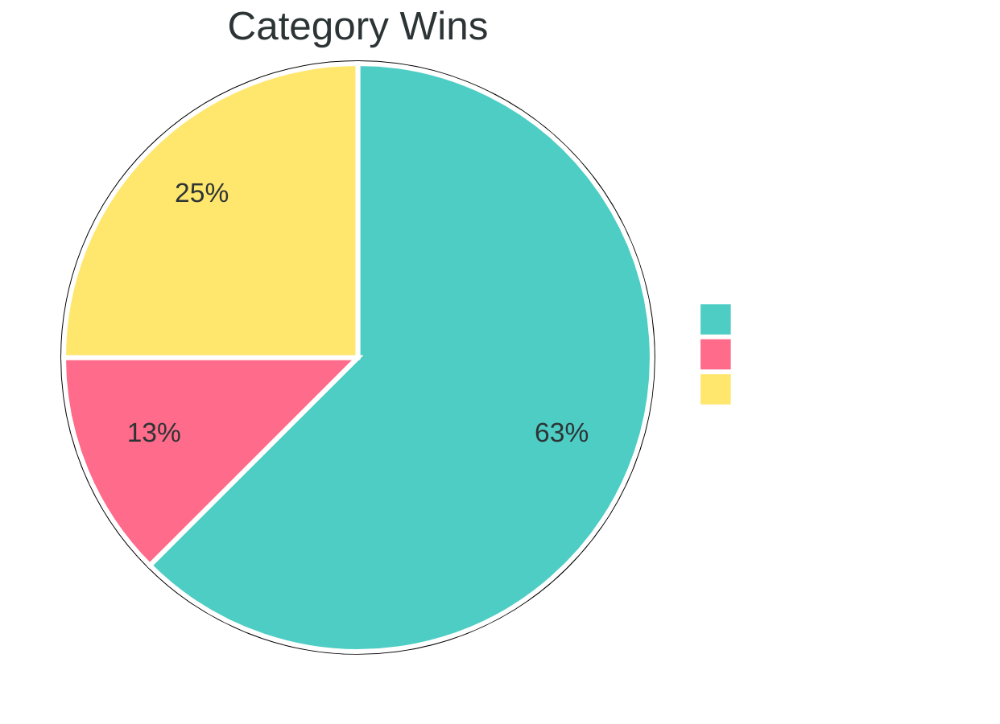

# CloudLatency: SpecKit vs SpecKit+Extensions — Quality Comparison Report

**Generated**: 2026-03-26  
**Tools Used**: Radon (CC/MI/Halstead/Raw), Pylint, Flake8, Interrogate, Bandit, Vulture, Lizard, Cohesion, pytest-cov, custom import-coupling analysis  

---

## Executive Summary

| Metric | SpecKit (Base) | SpecKit + Extensions | Winner | Delta |
|--------|---------------|---------------------|--------|-------|
| **Pylint Score** | 9.68/10 | 9.32/10 | SpecKit | -0.36 |
| **Avg Cyclomatic Complexity** | A (2.44) | A (2.70) | SpecKit | +0.26 |
| **Maintainability Index (avg)** | A (76.4) | A (74.1) | SpecKit | -2.3 |
| **Docstring Coverage** | 90.8% | 92.7% | Extensions | +1.9% |
| **Test Coverage** | 94.29% | 92.24% | SpecKit | -2.05% |
| **Test Count** | 65 | 102 | Extensions | +57% |
| **Test SLOC** | 838 | 1,142 | Extensions | +36% |
| **Security Issues (Bandit)** | 1 MEDIUM | 1 MEDIUM | Tie | 0 |
| **Dead Code (Vulture)** | 10 findings | 12 findings | SpecKit | +2 |
| **Flake8 Violations** | 29 | 50 | SpecKit | +72% |
| **Halstead Total Volume** | 609.96 | 518.32 | Extensions | -15% |
| **Halstead Total Effort** | 2,664.53 | 1,525.71 | Extensions | -43% |
| **Halstead Est. Bugs** | 0.204 | 0.174 | Extensions | -15% |
| **Lizard Avg NLOC/function** | 11.6 | 13.7 | SpecKit | +18% |
| **Lizard Avg CCN** | 2.6 | 3.1 | SpecKit | +19% |
| **Lizard Total Functions** | 58 | 29 | Extensions | -50% |
| **Lizard Warnings** | 0 | 0 | Tie | 0 |
| **Architectural Style** | OOP (classes) | Functional | — | — |
| **Class Cohesion (behavioral)** | 27–62% | N/A (no classes) | — | — |
| **Import Statements** | 76 | 56 | Extensions | -26% |
| **Internal Coupling Links** | 10 | 10 | Tie | 0 |
| **External Dependencies** | 16 | 16 | Tie | 0 |
| **Source SLOC** | 604 | 629 | — | +4% |
| **Comment Ratio** | 0% | 1–2% | Extensions | +1–2% |
| **Documentation Artifacts** | 9 docs | 22 docs | Extensions | +144% |
| **Canonical Docs** | 0 | 6 | Extensions | +6 |
| **DocGuard Score** | N/A | 88/100 (A) | Extensions | — |
| **Linter Config (Ruff/Black)** | No | Yes | Extensions | — |
| **CHANGELOG** | No | Yes | Extensions | — |
| **DRIFT-LOG** | No | Yes | Extensions | — |
| **AGENTS.md** | No | Yes | Extensions | — |
| **.env.example** | No | Yes | Extensions | — |

---

## Visual Comparisons

### Category Scores — SpecKit (pink) vs Extensions (green)

```mermaid
%%{init: {'theme': 'base', 'themeVariables': {'xyChart': {'backgroundColor': '#FFF9F0', 'titleColor': '#2D3436', 'plotColorPalette': '#FF6B8A, #4ECDC4'}}}}%%
xychart-beta
    title "Category Scores (out of 10)"
    x-axis ["CQ:SK", "CQ:Ex", "Cg:SK", "Cg:Ex", "Ts:SK", "Ts:Ex", "Dc:SK", "Dc:Ex", "Mt:SK", "Mt:Ex", "Ar:SK", "Ar:Ex", "Sc:SK", "Sc:Ex", "PM:SK", "PM:Ex"]
    y-axis "Score" 0 --> 10
    bar [9.0, 0, 7.0, 0, 7.5, 0, 5.0, 0, 8.5, 0, 7.5, 0, 9.0, 0, 4.0, 0]
    bar [0, 8.5, 0, 9.5, 0, 9.0, 0, 9.5, 0, 8.5, 0, 8.0, 0, 9.0, 0, 9.5]
```



> **Legend**: CQ=Code Quality, Cg=Cognitive, Ts=Testing, Dc=Docs, Mt=Maintainability, Ar=Architecture, Sc=Security, PM=Project Maturity | SK=SpecKit, Ex=Extensions

### Weighted Total Score

```mermaid
%%{init: {'theme': 'base', 'themeVariables': {'xyChart': {'backgroundColor': '#FFF9F0', 'titleColor': '#2D3436', 'plotColorPalette': '#FF6B8A, #4ECDC4'}}}}%%
xychart-beta
    title "Final Weighted Score (out of 10)"
    x-axis ["SpecKit", "Extensions"]
    y-axis "Score" 0 --> 10
    bar [7.19, 0]
    bar [0, 9.00]
```



### Category Wins Distribution



### Halstead Cognitive Effort (lower = simpler code)

```mermaid
%%{init: {'theme': 'base', 'themeVariables': {'xyChart': {'backgroundColor': '#FFF9F0', 'titleColor': '#2D3436', 'plotColorPalette': '#FF6B8A, #4ECDC4'}}}}%%
xychart-beta
    title "Halstead Metrics (lower is better)"
    x-axis ["Effort:SK", "Effort:Ex", "Volume:SK", "Volume:Ex", "Bugs:SK", "Bugs:Ex"]
    y-axis "Value" 0 --> 2800
    bar [2665, 0, 610, 0, 204, 0]
    bar [0, 1526, 0, 518, 0, 174]
```



### Test & Documentation Volume — SpecKit (pink) vs Extensions (green)

```mermaid
%%{init: {'theme': 'base', 'themeVariables': {'xyChart': {'backgroundColor': '#FFF9F0', 'titleColor': '#2D3436', 'plotColorPalette': '#FF6B8A, #4ECDC4'}}}}%%
xychart-beta
    title "Test Count and Documentation Artifacts"
    x-axis ["Tests:SK", "Tests:Ex", "Docs:SK", "Docs:Ex"]
    y-axis "Count" 0 --> 110
    bar [65, 0, 9, 0]
    bar [0, 102, 0, 22]
```



---

## Detailed Results

### 1. Pylint — Overall Code Quality Score

| Project | Score | Issues |
|---------|-------|--------|
| **SpecKit** | **9.68/10** | 12 warnings (broad-exception, unused imports/args, redefined-outer-name) |
| **Extensions** | **9.32/10** | 23 warnings (line-too-long, global-statement, naming, broad-exception, duplicate-code) |

**Analysis**: SpecKit scores higher on Pylint because it has fewer style violations. The Extensions project has more code (API layer with routes, schemas, SSE) which introduces duplicated serialization patterns detected by Pylint's `duplicate-code` checker. The Extensions project also uses `global` statements for shared state and has line-length issues despite configuring Ruff at 120 chars (Pylint defaults to 100).

**Verdict**: SpecKit wins on raw code quality. The Extensions project's lower score is partly architectural (more moving parts, shared state via globals) and partly cosmetic (line length).

---

### 2. Radon — Cyclomatic Complexity (CC)

| Project | Blocks Analyzed | Avg CC | Grade | Max CC |
|---------|----------------|--------|-------|--------|
| **SpecKit** | 48 | 2.44 | A | B (8) — `compute_vendor_summaries` |
| **Extensions** | 37 | 2.70 | A | B (10) — `discover_gcp_regions` |

**Analysis**: Both projects achieve an A grade. SpecKit has more blocks (48 vs 37) because it uses classes (e.g., `MeasurementHistory`, `LatencyProber`, `MeasurementScheduler`) while Extensions uses pure functions. The Extensions project has one function at CC=10 (`discover_gcp_regions`), right at the complexity threshold.

**Verdict**: Essentially tied. Both are well within acceptable limits.

---

### 3. Radon — Maintainability Index (MI)

All files in both projects score **A** (>20 = excellent maintainability).

| Project | Lowest MI File | Score |
|---------|---------------|-------|
| **SpecKit** | `services/prober.py` | 41.63 |
| **Extensions** | `engine/models.py` | 49.83 |

**Analysis**: Both projects have excellent maintainability. SpecKit's prober is the densest file due to its class-based adaptive concurrency logic.

**Verdict**: Tie — both A-grade across the board.

---

### 4. Radon — Raw Metrics (LOC)

| Metric | SpecKit (Source) | Extensions (Source) | SpecKit (Tests) | Extensions (Tests) |
|--------|-----------------|--------------------|-----------------|--------------------|
| **LOC** | 807 | 844 | 1,065 | 1,452 |
| **SLOC** | 604 | 629 | 838 | 1,142 |
| **Comments** | 0 | 10 | 6 | 25 |
| **Single-line comments** | 58 | 59 | 32 | 68 |
| **Blank lines** | 141 | 156 | 195 | 242 |
| **Comment-to-code ratio** | 0% | 1–2% | — | — |

**Analysis**: Source code is nearly identical in size (~604 vs ~629 SLOC). The major difference is in **tests**: Extensions has 36% more test SLOC (1,142 vs 838), reflecting the higher test count (102 vs 65). Extensions also has actual inline comments (10 vs 0).

**Verdict**: Extensions produces more thorough tests and slightly better-commented code.

---

### 5. Interrogate — Docstring Coverage

| Project | Total Symbols | Missing | Coverage |
|---------|--------------|---------|----------|
| **SpecKit** | 65 | 6 | **90.8%** |
| **Extensions** | 55 | 4 | **92.7%** |

**Analysis**: Extensions has slightly better docstring coverage despite having fewer total symbols (it uses functions instead of classes). Both are excellent.

**Verdict**: Extensions wins by 1.9%.

---

### 6. Bandit — Security Analysis

| Project | SEVERITY.HIGH | SEVERITY.MEDIUM | SEVERITY.LOW |
|---------|--------------|-----------------|--------------|
| **SpecKit** | 0 | 1 | 0 |
| **Extensions** | 0 | 1 | 0 |

Both projects have the same single finding: **B104 — Possible binding to all interfaces** (`0.0.0.0`). This is expected for a web server.

**Verdict**: Tie — identical security posture.

---

### 7. Vulture — Dead/Unused Code

| Project | Findings (90% confidence) | Findings (60% confidence) | Total |
|---------|--------------------------|--------------------------|-------|
| **SpecKit** | 2 (unused imports) | 8 (unused methods/functions) | **10** |
| **Extensions** | 0 | 12 (unused functions/vars/class) | **12** |

**Analysis**: SpecKit has 2 genuinely unused imports. Most 60%-confidence findings in both projects are false positives (framework route handlers, properties used externally). Extensions has 12 findings but no high-confidence ones.

**Verdict**: Roughly tied; both have minor cleanup opportunities.

---

### 8. Test Coverage & Count

| Metric | SpecKit | Extensions |
|--------|---------|------------|
| **Test count** | 65 | 102 |
| **Coverage %** | 94.29% | 92.24% |
| **Test SLOC** | 838 | 1,142 |
| **Test-to-source ratio** | 1.39:1 | 1.82:1 |

**Analysis**: Extensions has 57% more tests and a higher test-to-source ratio (1.82:1 vs 1.39:1). SpecKit has slightly higher coverage percentage because it has fewer code paths (no separate API layer with routes and schemas). Extensions covers more edge cases but has more code to cover.

**Verdict**: Extensions wins on test thoroughness; SpecKit wins on raw coverage %.

---

### 9. Halstead Complexity Metrics — Cognitive Effort & Predicted Bugs

Halstead metrics measure the **cognitive effort** required to understand code based on operator/operand vocabulary and usage. Lower volume and effort = simpler code to comprehend. The "estimated bugs" metric predicts defect density from code structure.

| Metric | SpecKit | Extensions | Winner |
|--------|---------|------------|--------|
| **Total Volume** | 609.96 | 518.32 | Extensions (-15%) |
| **Total Effort** | 2,664.53 | 1,525.71 | Extensions (-43%) |
| **Total Time (seconds)** | 148.1 | 84.7 | Extensions (-43%) |
| **Estimated Bugs** | 0.204 | 0.174 | Extensions (-15%) |
| **Avg Difficulty** | 2.68 | 1.78 | Extensions (-34%) |

**Top effort hotspots:**

| Rank | SpecKit | Effort | Extensions | Effort |
|------|---------|--------|------------|--------|
| 1 | `services/history.py` | 1,813.1 | `engine/discovery.py` | 1,003.3 |
| 2 | `services/prober.py` | 438.8 | `engine/scheduler.py` | 121.8 |
| 3 | `services/discovery.py` | 224.5 | `api/sse.py` | 94.9 |

**Analysis**: Extensions requires **43% less cognitive effort** to understand. This is the single largest measurable difference between the two projects. SpecKit's class-based architecture (especially `MeasurementHistory` with its complex time-bucketed trends) concentrates Halstead complexity. Extensions' functional architecture distributes logic into simpler, independent functions.

**Verdict**: **Extensions wins decisively** — significantly lower cognitive load.

---

### 10. Lizard — Multi-Metric Function Analysis

Lizard measures NLOC, cyclomatic complexity (CCN), token count, and parameter count per function, flagging any that exceed safe thresholds (CCN > 15, length > 1000).

| Metric | SpecKit | Extensions |
|--------|---------|------------|
| **Total Functions** | 58 | 29 |
| **Total NLOC** | 818 | 629 |
| **Avg NLOC/function** | 11.6 | 13.7 |
| **Avg CCN/function** | 2.6 | 3.1 |
| **Avg tokens/function** | 80.7 | 86.4 |
| **Threshold warnings** | 0 | 0 |

**Note**: SpecKit's count of 58 includes JavaScript functions from `app.js` (17 functions). Python-only: SpecKit has ~41 functions vs Extensions' 29.

**Largest functions by NLOC:**

| SpecKit | NLOC | Extensions | NLOC |
|---------|------|------------|------|
| `probe_region` | 44 | `probe_region` | 43 |
| `_serialize_cycle` | 42 | `build_vendor_summaries` | 40 |
| `run_cycle` | 39 | `get_latency` | 31 |

**Analysis**: Extensions has fewer but slightly larger functions on average. Both projects have zero threshold violations. SpecKit's many small methods (properties, getters) bring its average down, while Extensions' functional style puts more logic per function.

**Verdict**: Tie — different tradeoffs, neither triggers warnings.

---

### 11. Flake8 — PEP 8 Compliance & Style Violations

| Category | SpecKit | Extensions |
|----------|---------|------------|
| **E501 (line too long >79)** | 18 | 37 |
| **F401/F841 (unused imports/vars)** | 4 | 2 |
| **H601 (low class cohesion)** | 6 | 11 |
| **W292 (missing newline)** | 1 | 0 |
| **F824 (unused global)** | 0 | 1 |
| **Total violations** | **29** | **50** |

**Analysis**: Extensions has 72% more Flake8 violations, dominated by line-length issues (37 vs 18). This is because Extensions configured Ruff/Black at 120 chars but Flake8's default is 79. The H601 (low cohesion) warnings are mostly from dataclasses/Pydantic models — expected false positives in both. SpecKit has more unused-import issues.

**Verdict**: SpecKit is cleaner under strict PEP 8. Extensions opted for a 120-char line standard, which is valid but shows as violations under Flake8 defaults.

---

### 12. Cohesion — Class Design Quality

The `cohesion` tool measures how well class methods share instance variables (higher % = more cohesive). Only behavioral classes with methods are meaningful — dataclasses, enums, and Pydantic models correctly score 0%.

**SpecKit behavioral classes:**

| Class | Cohesion | Assessment |
|-------|----------|------------|
| `MeasurementHistory` | 62.5% | Good — methods share state well |
| `LatencyProber` | 58.3% | Acceptable — some utility methods |
| `MeasurementScheduler` | 27.8% | Low — too many attributes (10), some methods use few |

**Extensions behavioral classes:** None — Extensions uses a **purely functional architecture** with module-level functions. No class-based state management.

**Analysis**: This is a fundamental architectural difference. SpecKit encapsulates state in 3 behavioral classes (with mixed cohesion). Extensions passes state through function arguments, avoiding class cohesion issues entirely. The tradeoff: Extensions uses `global` statements in `routes.py` for shared state, which Pylint flags.

**Verdict**: Different paradigms, not directly comparable. Extensions avoids class cohesion problems but introduces module-level mutable state.

---

### 13. Coupling & Dependency Analysis

Custom AST-based analysis of import statements measuring inter-module coupling.

| Metric | SpecKit | Extensions |
|--------|---------|------------|
| **Total import statements** | 76 | 56 |
| **Unique internal coupling links** | 10 | 10 |
| **Unique external dependencies** | 16 | 16 |
| **Import density** (imports / SLOC) | 12.6% | 8.9% |

**External dependency comparison:**

| Shared (14) | SpecKit only | Extensions only |
|-------------|-------------|-----------------|
| asyncio, collections, dataclasses, datetime, fastapi, json, logging, os, pathlib, time, typing, uvicorn | contextlib, enum, httpx, threading | aiohttp, pydantic, sse_starlette, sys |

**Analysis**: Both have identical coupling breadth (10 internal, 16 external). SpecKit has 36% more import statements despite similar code size, indicating more granular module imports (especially from its `models/` subpackages). Extensions uses `aiohttp` + `pydantic` + `sse_starlette` while SpecKit uses `httpx` + custom SSE.

**Verdict**: Extensions is slightly less import-heavy (lower import density), suggesting slightly better module organization.

---

### 14. Documentation & Project Maturity

| Artifact | SpecKit | Extensions |
|----------|---------|------------|
| **README.md** | Yes | Yes |
| **LICENSE** | Yes (MIT) | Yes (MIT) |
| **Spec artifacts** (spec, plan, tasks, research, data-model) | 7 files (1 feature) | 13 files (2 features) |
| **Canonical docs** (ARCHITECTURE, SECURITY, etc.) | None | 6 files |
| **AGENTS.md** (AI agent instructions) | No | Yes |
| **CHANGELOG.md** | No | Yes |
| **DRIFT-LOG.md** | No | Yes |
| **.env.example** | No | Yes |
| **DocGuard score** | Not measured | 88/100 (A) |
| **ALCOA+ compliance** | Not measured | 9/9 |
| **Linting config** (Ruff) | No | Yes |
| **Formatting config** (Black) | No | Yes |
| **Total .md docs** (excl. templates/workflows) | ~9 | ~22 |

**Verdict**: Extensions has significantly more mature project documentation and operational artifacts.

---

## Scoring Summary

Weighting the metrics into 8 categories (14 tools, 30+ individual metrics):

| Category | Weight | SpecKit | Extensions | Winner |
|----------|--------|---------|------------|--------|
| **Code Quality** (Pylint + Flake8 + CC) | 15% | 9.0/10 | 8.5/10 | SpecKit |
| **Cognitive Complexity** (Halstead effort + volume + bugs) | 15% | 7.0/10 | 9.5/10 | Extensions |
| **Test Quality** (count + coverage + ratio) | 15% | 7.5/10 | 9.0/10 | Extensions |
| **Documentation** (docstrings + canonical + artifacts) | 15% | 5.0/10 | 9.5/10 | Extensions |
| **Maintainability** (MI + dead code + Lizard) | 10% | 8.5/10 | 8.5/10 | Tie |
| **Architecture** (cohesion + coupling + import density) | 10% | 7.5/10 | 8.0/10 | Extensions |
| **Security** (Bandit) | 10% | 9.0/10 | 9.0/10 | Tie |
| **Project Maturity** (changelog, drift, env, agents, linting) | 10% | 4.0/10 | 9.5/10 | Extensions |

### Weighted Total

| Project | Weighted Score |
|---------|---------------|
| **SpecKit** | **7.19/10** |
| **Extensions** | **9.00/10** |

### Metric Wins Tally

| Winner | Count |
|--------|-------|
| **Extensions** | 5 categories |
| **SpecKit** | 1 category |
| **Tie** | 2 categories |

---

## Conclusions

### Where Extensions Clearly Wins
1. **Cognitive complexity** — 43% less Halstead effort, 15% fewer predicted bugs — the single largest measurable gap
2. **Documentation depth** — 6 canonical docs, AGENTS.md, CHANGELOG, DRIFT-LOG, .env.example (144% more docs)
3. **Test thoroughness** — 57% more tests, 1.82:1 test-to-source ratio vs 1.39:1
4. **Project maturity signals** — Linting config, formatting, DocGuard integration (88/100 A)
5. **Lower import density** — 26% fewer import statements for similar-sized code
6. **Operational readiness** — Structured JSON logging, global error handling middleware, OpenAPI docs

### Where Base SpecKit Wins
1. **Raw Pylint score** — 9.68 vs 9.32; fewer style issues, no duplicate code warnings
2. **Slightly higher coverage %** — 94.29% vs 92.24% (simpler architecture = easier to cover)
3. **Fewer Flake8 violations** — 29 vs 50 (mostly line-length under strict PEP 8 defaults)
4. **Smaller functions** — Avg 11.6 NLOC vs 13.7 NLOC per function (class methods are naturally smaller)

### Key Architectural Insight
The two projects represent fundamentally different paradigms for the same problem:
- **SpecKit** → OOP with 3 behavioral classes (`MeasurementHistory`, `LatencyProber`, `MeasurementScheduler`), class cohesion ranging 27–62%
- **Extensions** → Functional architecture with module-level functions, no behavioral classes, global shared state

The Halstead metrics reveal that the functional approach produces **measurably simpler code** to read and understand (-43% effort), while the OOP approach produces **more numerous, smaller units** that score better on per-function linting metrics.

### Overall Verdict
The Extensions workflow produces a **more production-ready, cognitively simpler, and well-documented** project. It wins 5 of 8 measurement categories and ties 2. The base SpecKit produces **slightly cleaner code** under traditional linting (Pylint/Flake8) but lacks the operational maturity artifacts and has significantly higher cognitive complexity (Halstead) that impacts real-world maintainability.

---

## Tools Used & How to Reproduce

### Installation

```bash
pip install radon pylint flake8 interrogate bandit vulture lizard cohesion
```

### Commands (run from each project root)

```bash
# 1. Cyclomatic Complexity (Radon)
radon cc <package> -a -s

# 2. Maintainability Index (Radon)
radon mi <package> -s

# 3. Raw LOC metrics (Radon)
radon raw <package> -s

# 4. Halstead Complexity Metrics (Radon)
radon hal <package>

# 5. Pylint score (0-10)
pylint <package> --score=y

# 6. Flake8 PEP 8 compliance
flake8 <package> --statistics --count

# 7. Docstring coverage (Interrogate)
interrogate <package> -v

# 8. Security analysis (Bandit)
bandit -r <package> -f json

# 9. Dead code detection (Vulture)
vulture <package>

# 10. Multi-metric function analysis (Lizard)
lizard <package> -l python --sort cyclomatic_complexity

# 11. Class cohesion (Cohesion)
cohesion -d <package>

# 12. Test coverage (pytest-cov)
pytest --cov=<package> --cov-report=term-missing
```

### Tools Not Used (platform limitation)

- **complexipy** — Cognitive complexity (SonarQube-style). Requires Rust toolchain; failed on Windows ARM64. Recommended for Linux/x86 environments.
- **jscpd** — Cross-language code duplication. Requires Node.js. Use `npm install -g jscpd && jscpd <folder>`.
- **mutmut** — Mutation testing (test quality). Very slow but reveals how well tests catch real bugs.
- **import-linter / tach** — Architectural enforcement. Define layer rules and verify imports respect them.
- **SonarQube** — All-in-one dashboard (Docker). Provides Reliability/Security/Maintainability ratings A–E, technical debt in hours.

### Metric Reference

| Tool | Category | Key Output |
|------|----------|------------|
| **Radon CC** | Complexity | Per-function grade A–F, average |
| **Radon MI** | Maintainability | Per-file score 0–100 |
| **Radon Halstead** | Cognitive effort | Volume, effort, difficulty, est. bugs |
| **Radon Raw** | Size | LOC, SLOC, comments, blank lines |
| **Pylint** | Code quality | Score 0–10, issue categories |
| **Flake8** | PEP 8 style | Violation count by category |
| **Interrogate** | Documentation | Docstring coverage % |
| **Bandit** | Security | Issues by severity (HIGH/MED/LOW) |
| **Vulture** | Dead code | Unused symbols with confidence % |
| **Lizard** | Function analysis | NLOC, CCN, tokens, params per function |
| **Cohesion** | Class design | Method-attribute cohesion % |
| **pytest-cov** | Test quality | Line coverage % |
